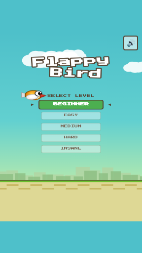
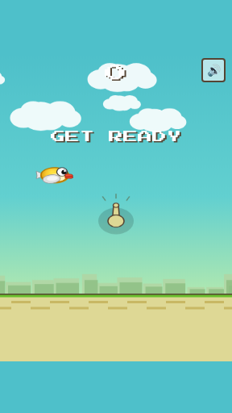
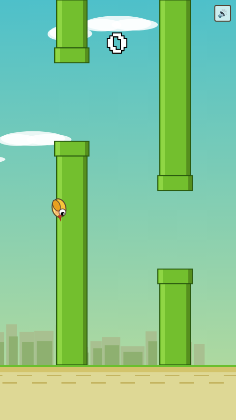
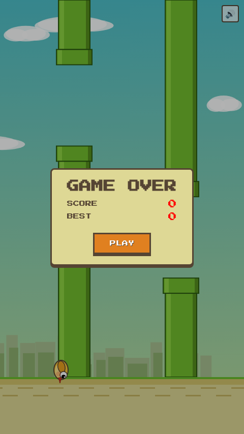

# 🐦 Flappy Bird

<div align="center">


**A faithful Flappy Bird recreation with 5 difficulty levels — from Beginner to Insane!**

[▶ Play Now](https://alfredang.github.io/flappy-bird-game/)

</div>

---

## 📸 Screenshots

<div align="center">

| Level Select | Get Ready | Gameplay | Game Over |
|:---:|:---:|:---:|:---:|
|  |  |  |  |

</div>

## 🎯 Difficulty Levels

| Level | Description |
|-------|------------|
| 🟢 **BEGINNER** | Feather-light gravity, huge pipe gaps, super slow — perfect for learning |
| 🟩 **EASY** | Gentle float, wide gaps, forgiving hitbox |
| 🟠 **MEDIUM** | Balanced classic feel — the original experience |
| 🔴 **HARD** | Fast pipes, narrow gaps, tight hitbox |
| 🟣 **INSANE** | Extreme speed, tiny gaps, pixel-perfect collisions |

Use **↑↓** arrow keys to select, **Space** to start. On mobile, tap the level buttons.

## ✨ Features

- **5 difficulty levels** — from super easy to insanely hard
- **Classic Flappy Bird visuals** — blue sky, green pipes, puffy clouds, city skyline
- **Cute illustrated bird** — orange body, red beak, flapping wing animation
- **GET READY screen** — with tap hand icon
- **Game Over panel** — score, best score, medals (bronze/silver/gold), NEW badge
- **Per-level high scores** — tracked separately in localStorage
- **Sound effects** — synthesized via Web Audio API
- **Mobile responsive** — tap to flap
- **Mute toggle** — sound on/off
- **Zero dependencies** — single HTML file

## 🎮 Controls

| Platform | Action |
|----------|--------|
| Desktop | `Space` / `↑` / Click to flap · `↑↓` to select level |
| Mobile | Tap level to select · Tap to flap |

## 🖼️ Tech Stack

| Technology | Purpose |
|-----------|---------|
| HTML5 Canvas | Game rendering |
| Vanilla JavaScript | Game logic & physics |
| Web Audio API | Synthesized sound effects |
| CSS3 | UI & scaling |

## 🚀 Getting Started

```bash
git clone https://github.com/alfredang/flappy-bird-game.git
open index.html
```

No build step — single HTML file.

## 📝 License

MIT
