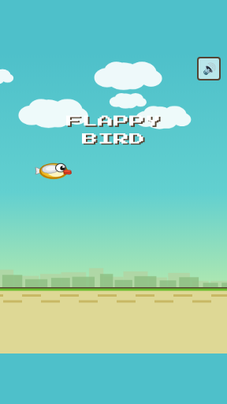
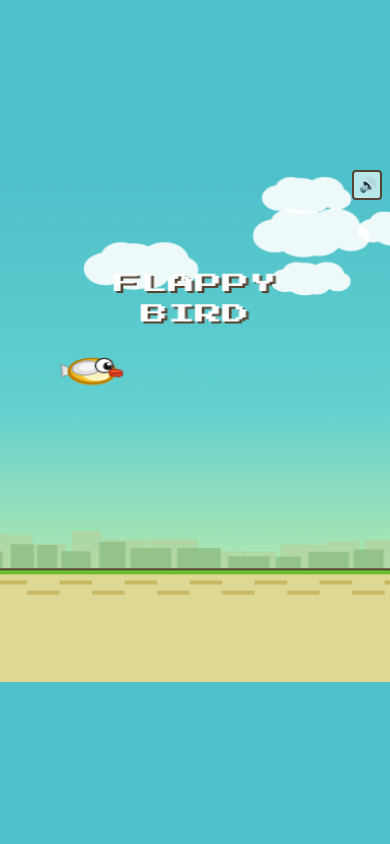
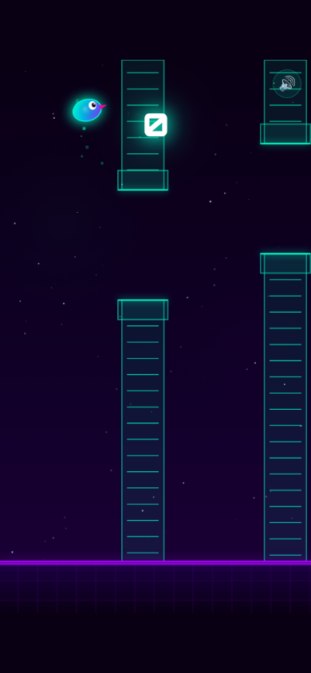

# 🐦 Neon Flappy

<div align="center">


**A cyberpunk-themed Flappy Bird with neon aesthetics, particle trails & synthesized sound effects.**

[▶ Play Now](https://alfredang.github.io/flappy-bird-game/)

</div>

---

## 📸 Screenshots

<div align="center">

### Start Screen


### Gameplay


### Game Over


### Mobile
 &nbsp; 

</div>

## ✨ Features

- **Neon cyberpunk aesthetic** — glowing pipes, particle trails, nebula background
- **Wave-based difficulty** — pipe gaps and speed scale with score
- **Sound effects** — synthesized via Web Audio API (flap, score, hit, death, fanfare)
- **Mute toggle** — sound on/off button
- **High score tracking** — persisted in localStorage
- **Mobile responsive** — touch to flap, optimized 9:16 aspect ratio
- **Particle system** — engine trails, score celebrations, death bursts
- **Screen flash** — impact feedback on collision
- **Zero dependencies** — single HTML file, no frameworks

## 🎮 Controls

| Platform | Action |
|----------|--------|
| Desktop | `Space` / `↑` / Click to flap |
| Mobile | Tap anywhere to flap |

## 🖼️ Tech Stack

| Technology | Purpose |
|-----------|---------|
| HTML5 Canvas | Game rendering |
| Vanilla JavaScript | Game logic & physics |
| Web Audio API | Synthesized sound effects |
| CSS3 | UI overlay & neon styling |
| GitHub Actions | Auto-deployment to Pages |

## 🏗️ Architecture

```
flappy-bird-game/
├── index.html              # Complete game (single file)
├── screenshots/            # Playwright-captured screenshots
├── .github/
│   └── workflows/
│       └── deploy.yml      # GitHub Pages deployment
└── README.md
```

## 🚀 Getting Started

```bash
# Clone the repo
git clone https://github.com/alfredang/flappy-bird-game.git

# Open in browser
open index.html
```

No build step needed — it's a single HTML file.

## 📝 License

MIT
